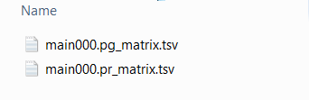
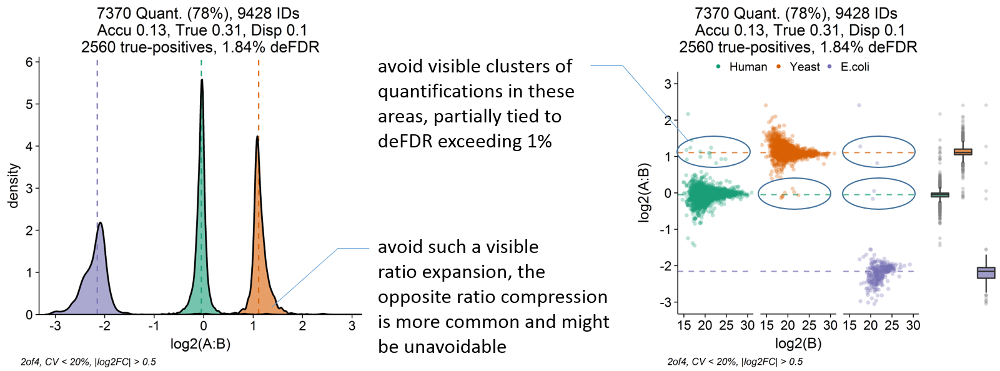

# LFQ_benchmark v3.2
Benchmarks of label-free quantification (LFQ) in bottom-up proteomics by DIA LC-MS and DIA-NN.


This script analyzes DIA-NN precursor and protein group matrices of LFQ benchmarks resulting
in plots and summary statistics representing sensitivity, quantitative accuracy, and overall reliability
in differential expression analysis.
It enables meaningful comparison of multiple result sets 
and has proven to be useful for DIA-NN setting optimization, performance benchmarks, and troubleshooting.
   
    
      
This script serves as an alternative to scripts and packages
from the following publications:

- Kuharev, Jörg, et al. "In‐depth evaluation of software tools for data‐independent acquisition based label‐free quantification." Proteomics 15.18 (2015): 3140-3151.

- Navarro, Pedro, et al. "A multicenter study benchmarks software tools for label-free proteome quantification." Nature biotechnology 34.11 (2016): 1130-1136.


A nice resource for benchmark raw files from various instrument types can be found here:
- https://www.ebi.ac.uk/pride/archive/projects/PXD028735

# Quick Start Guide
## Samples


- Sample mixtures are typically derived from commercial digests.
- Aim at ca. 3 replicates per condition.
- This script should handle different expected fold-changes and even 2-species mixtures directly, the orientation (yeast upregulated from B to A, etc.) is hard-coded, deviating might result in some summary stats to result in nonsense values.
- Only DIA-NN-style matrices can be directly analyzed. Both precursor and protein group are required as some critical errors 
might be missed otherwise.


## R Packages

```
# Install and load required base packages automatically.
# Bioconductor ones are separately below.
if (!require("pacman"))
  install.packages("pacman")
pacman::p_load(
  tidyr,
  dplyr,
  matrixStats,
  mratios,
  magrittr,
  statmod,
  scrime,
  moments,
  reshape2,
  grid,
  gridExtra,
  ggplot2,
  cowplot,
  scales)
```

```
if (!requireNamespace("BiocManager", quietly = TRUE))
  install.packages("BiocManager")
BiocManager::install("limma")
BiocManager::install("Biobase")
```
### Input Requirements
Prepare a folder containing exactly one precursor and one protein group matrix in .tsv format
with "pr_matrix" and "pg_matrix" in the respective filename. Other files are ignored. 
(Basically the results of one DIA-NN search, but additional "first-pass" files need to be moved away).



### Variables and Filter settings
In the variables section, set appropriate parameters. The most important ones can be seen here,
such as the folder location, column indices of the LFQ values, and filter settings.
The example below corresponds to:
- Precursor and protein groups will be counted as "IDs" if a value is reported in at least 2 of 4 replicates in both condition A and B.
- Precursor and protein groups will be counted as "Quantified" if they are "IDs" and have a CV less than 20% in both condition A and B.
- Quantified protein groups are subjected to differential expression analysis with limma with a statistical cutoff of 1% (0.01),
 however, protein groups are only recognized as up or downregulated if the log2 fold-change exceeds +-0.5 (overruling the adjusted p-value).
- Changing filter settings will not overwrite results but lead to a separate output folder.

```
folder_input <- "C:/Users/Tobias/Desktop/Test_Input"

cond_ctr <- "LFQ_B"
cond_exp <- "LFQ_A"

# # Pretyped 4 replicates per sample.
col_exp_Prot <- 6:9
col_ctr_Prot <- 10:13
col_exp_Prec <- 11:14
col_ctr_Prec <- 15:18

# Filter variables, listed in output folder name.
limit_MV <- (2 / 4)
limit_CV <- 20
limit_FC <- 0.5

# p_adj cut-off for diff. expr. analysis by limma.
alpha_limma <- 0.01
```

## Interpretation

Successful script execution results in a subfolder within the input folder.
It contains various plots for precursor and protein group-level entries passing the filter settings
plus csv files for script variables, asymmetry summary stats and main summary stats.


1) Check all plots for anything unusual incl. Precursor-level. Expect the unexpected.


2) Check for appropriate normalisation.
Potential erroneous offsets (medians or scatter plots) could invalidate the
summary stats generated. While ratio compression or expansion can move 
Yeast and E.coli medians, the critical normalisation related errors typically shift 
Human and Yeast medians or data points by the same distance and direction 
on the log2 fold-change axis.


3) Check reliability to prevent excess false positives in differential expression analysis.
Reliability is related to the deFDR value and the presence of aberrant quantifications
in facet plots. Artificially increased protein group FDR leads to clear clusters
of human protein groups around the expected Yeast log2 fold-change, and vice versa.
A deFDR below 1 %, the absence of such clusters and no strong ratio expansion
speak for excellent reliability. A workflow optimized to minimize these error sources
might be less likely to result in false positives during differential expression applications.
Depending on the scope and replicate numbers, deFDR values higher than 1 %
might be tolerated.


4) Check fold-change over-or underestimation.
One of the most overlooked issues in quantitative proteomics.
Orbitrap data might result in ratio expansion while ToF data might result in the 
opposing ratio compression, both cases depend on the analysis settings.
A separate data frame and output file lists multiple stats related to these.
The most useful one seems to be the Asymmetry_Factor. 

A Factor of 1 means perfect symmetry and no bias. 
0.5 indicates a strong and undesirable underestimation, leading to slightly differentially
abundant proteins not recognized correctly as such.
The increased number of false negatives means
differential expression results can be reliable but less sensitive.
An Asymmetry_Factor of 2 indicates a strong and undesired fold-change overestimation.
Might lead to a slightly increased deFDR and false positive rate 
in differential expression applications.


5) Check Precision.
Good Precision is a requirement for overall accuracy.
When working with ca. 3 replicates and a CV filter of 20%,
it seems well sufficient if a result set ends up with average and median
CV at or below 5 %. The value aimed at might vary based on replicate number,
proteome coverage, and intended application outside of benchmarks.
While workflows with higher values might be reliable, a loss of 
sensitivity in differential expression applications is expected at some point.


6) When optimizing, DIA-NN or instrument settings, etc.,
aim to stay within a specified deFDR and ratio compression / extension
while maximizing the true positive count. A TP count exceeding 2500 is quite good, 
3000 seems hard to reach and might be close to the upper limit. The scaling is non-linear, 
increasing from 2.5k to 3k is more difficult than from 2k to 2.5k.





Most other stats serve just as indicators and are therefore explained in the script.
Summary stats are nice, but dataviz has greater potential to reveal unexpected errors.
 
Happy benchmarking (:


