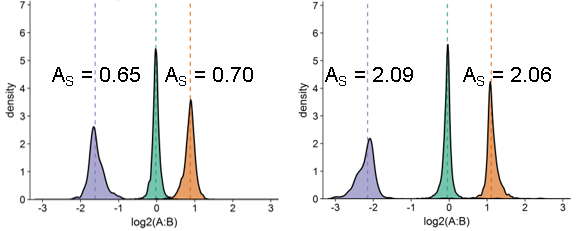

# LFQ_bout v3.4
**Defining and achieving high accuracy in untargeted bottom-up proteomics.**


_Certain figures will be added after the preprint is published_

To benchmark the overall performance and accuracy in untargeted bottom-up proteomics,
multi-species sample mixtures providing expected log2 fold changes are frequently used.
However, we observed that the benchmark data is usually analyzed in a vastly insufficient fashion.

Here, we provide principles, guidelines, and an R script to achieve full validation
and practical performance and accuracy evaluation. The goal is to acquire graphs, summary statistics, and thresholds
providing exact information if a particular dataset/workflow is accurate/valid or not,
and also enable meaningful performance comparison of multiple workflows to compare software, LC-MS setups, settings, etc.


The following 2 main sections will be a quick start guide 
followed by a guide on error sources and how to find them in bottom-up proteomics data.

A nice resource for benchmark raw files from various instrument types can be found here:
- https://www.ebi.ac.uk/pride/archive/projects/PXD028735


  
# Quick Start Guide
## Samples

Classical Benchmark         |  Variant to validate cross-run Normalisation
:-------------------------:|:-------------------------:
  |  


- Sample mixtures are typically derived from commercial digests.
- The script can accommodate any common 2-4 species mixtures with minimal adjustments, thresholds are provided for the classical 3-species benchmark.
- The orientation (yeast upregulated from B to A, etc.) is hard-coded.
- Requires at least 2 replicates per condition, better 3.
- Variant specifically to benchmark normalization requires sample B to be diluted to 70% of its original concentration


## Minimum Data Input

- The script was designed to function on a DIA-NN output without MBR, other outputs can be quickly reformatted to fit, please see below.
- A folder is specified as a script input variable that contains exactly one protein group and one precursor matrix in .tsv format with "pg.matrix" or "pr.matrix" in the respective filename. 
- Other files are ignored.
- If DIA-NN MBR is enabled, one set of results has to be moved into a different folder.

```
folder_input <- "C:/Users/Tobias/Desktop/Example_Input"
```

- To select the folder, I recommend using "Path Copy Copy" with the following settings
to easily copy&paste folder links in a format usable for RStudio.
 


 
 
 
 
**Protein Group Matrix / Precursor Matrix (minimum layout)**

| Protein.Group | Protein.Names   | A01      | A02        |A03      | B01      | B02        |B03      |
| :---:         |     :---        |     :--- |:---        |	:---    |     :--- |:---        |	:---    |
| 1             | PIOS1_HUMAN     | 1.48E+06 |	1.46E+06  |1.47E+06 | 1.61E+06|	1.56E+06  |1.51E+06 |
| 2             | SHOT1_HUMAN     | 1.82E+06 |1.85E+06    |	1.65E+06|1.81E+06  |	1.72E+06   |		1.94E+06|
| 3             | ESYT2_HUMAN     | 2.86E+06 |	3.00E+06  |	2.86E+06|3.04E+06	  |	3.02E+06  |		3.05E+06|

- "Protein.Group" needs to be any kind of identifier, multiple Precursors can have the same protein group
- "Protein.Names" needs to contain species suffixes to remove mixed-species entries and MaxQuant contaminants
- Quantitative values for the 2 sample types are defined by their column indices
- Other columns are ignored/dragged along


		


## R Packages

- Both base and Bioconductor packages should be installed automatically
- A common problem is RStudio not being allowed to write in Windows folders
- Executing the script the first time with RStudio opened as Administrator might help


## Variables and Filter settings
In the variables section, set appropriate parameters. The most important ones can be seen here,
such as the folder location, column indices of the quantitative values, and filter settings.
The example below corresponds to:
- Precursor and protein groups will be counted as "IDs" if a value is reported in at least 2 of 3 replicates in both conditions A and B.
- Precursor and protein groups will be counted as "Quantified" if they are "IDs" and have a CV less than 20% in both conditions A and B.
- Quantified protein groups are subjected to differential expression analysis with limma with a statistical cutoff of 1% (0.01),
 however, protein groups are only recognized as up- or downregulated if the log2 fold-change exceeds +-0.5 (overruling the adjusted p-value).
- Changing filter settings will not overwrite results but lead to a separate output folder.

```
folder_input <- "C:/Users/Tobias/Desktop/Test_Input"

cond_ctr <- "LFQ_B"
cond_exp <- "LFQ_A"

# # Pretyped 3 replicates per sample type.
col_exp_Prot <- 6:8
col_ctr_Prot <- 9:11
col_exp_Prec <- 11:13
col_ctr_Prec <- 14:16

# Filter variables, listed in the output folder name.
limit_MV <- (2 / 3)
limit_CV <- 20
limit_FC <- 0.5

# p_adj cut-off for diff. expr. analysis by Limma.
alpha_limma <- 0.01

# Expected log2 fold changes by sample mixtures.
expFC_human <- 0
expFC_yeast <- +1
expFC_ecoli <- -2
expFC_celegans <- -1
```


# Error Sources
The following is a quick outline of which errors can occur
in bottom-up proteomics data, how to spot them, and to which degree they can be present for a result set
to be recognized as accurate

## Normalisation Errors
-	Cross-run normalization aims at equalizing differences in sample loading etc. and it is crucial to obtain high quantitative precision and prevent batch effects
-	The benchmark variant uses dilution of one sample to mimic a batch effect of sample loading.
-	A dilution of sample B to 70% shifts all measured, non-normalized log2 fold-changes by +0.5
-	A proper normalization (RT-dep, DIA-NN v1.8) restores the originally expected log2 fold-changes
-	If software introduces errors by improper normalization, this is best observed on Precursor scatter plots. Additionally, increased summary stats are (Precursor_Trueness, Precursor_Accuracy, deFDR, FP, and FN), and reduced summary stats are (TP, Sensitivity, and Specificity).
-	Any detectable error (incl. over- or under-correction) leads to the workflow being recognized as invalid

 


 

## System Errors
-	Always check the graphs, especially for the precursor level. An elevated deFDR statistic can also indicate such errors.
-	Even unexpected nonsense quantifications apart from normalization errors were detected
-	The detectable presence of errors indicating severe problems with instrumentation hard- or software leads to the workflow being recognized as invalid

 


## Dispersion of Quantification (Precision Error)
-	random quantification error, observed as standard deviation or the coefficient of variation (CV) over replicates
-	For technical replicates of commercial digest samples, a reasonable aim is an average and mean CV below 5%
-	Evaluation can be replaced by optimizing a workflow incl. biol. variability and sample preparation to maximize the number of protein groups quantified with a CV < 20% (Prot_Quant)
-	While precision errors can be tolerated to some degree, high precision is a requirement for high accuracy
 

## Distortion of Quantification 
-	Tendency of a workflow to over or underestimate fold-changes (Ratio expansion o compression)
-	best observed in protein group density plots and asymmetry factors
-	Asymmetry factors should be between 0.5 and 2.0. A value of 1.0 reflects density symmetry.
-	Ratio compression reduces true positives and increases false negatives
-	Ratio expansion possibly increases false positives
-	ToF data typically shows strong ratio compression
-	Orbitrap data can show a net ratio expansion, but might not be free a some ratio compression

 


 
## Identification Errors 
-	Erroneous Assignments of signals to the wrong precursors/peptides/protein groups
-	Random ID errors are of little concern if data is filtered for repeated and precise protein groups before statistical analysis
-	Most dangerous are ID errors surviving such filtering, which scale along protein group FDR
-	Best observed in protein group facet plots and with increased deFDR values
-	Ideally, keep deFDR below 1.0%
-	Alternatively, use 0.5% intervals as “weight classes” for result sets, and only compare the performance of results sets of one weight class with each other
-	Using the deFDR is vital to penalize result sets pushing ID numbers at the cost of higher rates of misidentifications 


 


 
## Overall Strategy
-	Exclude the presence of system and normalization errors
-	evaluate accuracy/validity regarding dispersion, distortion, and ID errors
-	Workflows with summary statistics exceeding any threshold are inaccurate, workflows passing all thresholds are accurate (defDR < 1%, Mean CV < 5%, asymmetry factors between 0.5 and 2.0)
-	Accurate workflows are ranked by their true positive count as an improved performance indicator compared to ID numbers


# Literature

This script serves as an alternative to scripts and packages
from the following publications:

- Kuharev, J., Navarro, P., Distler, U., Jahn, O., & Tenzer, S. (2015). In-depth evaluation of software tools for data-independent acquisition based label-free quantification. Proteomics, 15(18), 3140–3151. https://doi.org/10.1002/pmic.201400396

- Navarro, P., Kuharev, J., Gillet, L. C., Bernhardt, O. M., MacLean, B., Röst, H. L., Tate, S. A., Tsou, C. C., Reiter, L., Distler, U., Rosenberger, G., Perez-Riverol, Y., Nesvizhskii, A. I., Aebersold, R., & Tenzer, S. (2016). A multicenter study benchmarks software tools for label-free proteome quantification. Nature Biotechnology, 34(11), 1130–1136. https://doi.org/10.1038/nbt.3685

The following publications also combined differential expression analysis with benchmark samples:

- Dowell, J. A., Wright, L. J., Armstrong, E. A., & Denu, J. M. (2021). Benchmarking Quantitative Performance in Label-Free Proteomics. ACS Omega, 6(4), 2494–2504. https://doi.org/10.1021/acsomega.0c04030

- Doellinger, J., Blumenscheit, C., Schneider, A., & Lasch, P. (2020). Optimization of data-independent acquisition using predicted libraries for deep and accurate proteome profiling. 3–10. https://doi.org/10.1101/2020.03.02.972570


