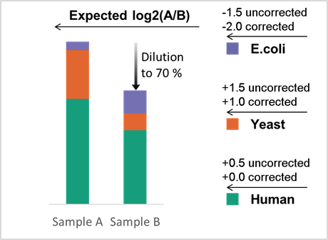

# LFQ_bout v3.4
Benchmarks of multispecies mixtures and label-free quantification (LFQ) in bottom-up proteomics by DIA LC-MS and DIA-NN.


This script analyzes DIA-NN precursor and protein group matrices of LFQ benchmarks resulting
in plots and summary statistics representing sensitivity, quantitative accuracy, and overall validity
in differential expression analysis.
It enables meaningful comparison of multiple result sets 
and has proven to be useful for DIA-NN setting optimization, performance benchmarks, and troubleshooting.
   
    
      
This script serves as an alternative to scripts and packages
from the following publications:

- Kuharev, Jörg, et al. "In‐depth evaluation of software tools for data‐independent acquisition based label‐free quantification." Proteomics 15.18 (2015): 3140-3151.

- Navarro, Pedro, et al. "A multicenter study benchmarks software tools for label-free proteome quantification." Nature biotechnology 34.11 (2016): 1130-1136.


A nice resource for benchmark raw files from various instrument types can be found here:
- https://www.ebi.ac.uk/pride/archive/projects/PXD028735

# Quick Start Guide
## Samples


- Sample mixtures are typically derived from commercial digests.
- Aim at ca. 3 replicates per condition. required are two conditions with at least 2 replicates each.
- This script should handle different expected fold-changes and even 2 or 4-species mixtures directly, the orientation (yeast upregulated from B to A, etc.) is hard-coded, deviating might result in some summary stats to result in nonsense values.
- Only DIA-NN-style matrices can be directly analyzed. Both precursor and protein group are required as some critical errors might be missed otherwise.


## R Packages

- Should be installed automatically, problems with Bioconductor packages not installing correctly due to RStudio not being allowed to write in windows directories are know.

```
# Install and load required base packages automatically.
# Bioconductor ones are separately below.
if (!require("pacman"))
  install.packages("pacman")
pacman::p_load(
  tidyr,
  dplyr,
  matrixStats,
  mratios,
  magrittr,
  statmod,
  scrime,
  moments,
  reshape2,
  grid,
  gridExtra,
  ggplot2,
  cowplot,
  scales)
```

```
# Install and load Bioconductor packages automaltically
# Update or install often prohibited by RStudio not allowed to write in folders.
# Try open RStudio "run as administrator" and use .libPaths() to find and manually
# delete folders via windows file explorer to allow fresh re-install. 
if (!requireNamespace("BiocManager", quietly = TRUE))
  install.packages("BiocManager")
library(BiocManager)

if (!requireNamespace("limma", quietly = TRUE))
  BiocManager::install("limma", update = FALSE)
library(limma)

if (!requireNamespace("Biobase", quietly = TRUE))
  BiocManager::install("Biobase", update = FALSE)
library(Biobase)
```
### Input Requirements
Prepare a folder containing exactly one precursor and one protein group matrix in .tsv format
with "pr_matrix" and "pg_matrix" in the respective filename. Other files are ignored. 
(Basically the results of one DIA-NN search, but additional "first-pass" files need to be moved away).



### Variables and Filter settings
In the variables section, set appropriate parameters. The most important ones can be seen here,
such as the folder location, column indices of the quantitative values, and filter settings.
The example below corresponds to:
- Precursor and protein groups will be counted as "IDs" if a value is reported in at least 2 of 3 replicates in both condition A and B.
- Precursor and protein groups will be counted as "Quantified" if they are "IDs" and have a CV less than 20% in both condition A and B.
- Quantified protein groups are subjected to differential expression analysis with limma with a statistical cutoff of 1% (0.01),
 however, protein groups are only recognized as up- or downregulated if the log2 fold-change exceeds +-0.5 (overruling the adjusted p-value).
- Changing filter settings will not overwrite results but lead to a separate output folder.

```
folder_input <- "C:/Users/Tobias/Desktop/Test_Input"

cond_ctr <- "LFQ_B"
cond_exp <- "LFQ_A"

# # Pretyped 3 replicates per sample type.
col_exp_Prot <- 6:8
col_ctr_Prot <- 9:11
col_exp_Prec <- 11:13
col_ctr_Prec <- 14:16

# Filter variables, listed in output folder name.
limit_MV <- (2 / 3)
limit_CV <- 20
limit_FC <- 0.5

# p_adj cut-off for diff. expr. analysis by limma.
alpha_limma <- 0.01

# Expected log2 fold-changes by sample mixtures.
expFC_human <- 0
expFC_yeast <- +1
expFC_ecoli <- -2
expFC_celegans <- -1
```

## Interpretation

Successful script execution results in a subfolder within the input folder.
It contains various plots for precursor and protein group-level entries passing the filter settings
plus csv files for script variables, asymmetry summary stats, filtered entry counts and main summary stats.


1) Check all plots for anything unusual, especially on the precursor level. Expect the unexpected.


2) Check for appropriate normalisation.
Potential erroneous offsets (visible in scatter and density plots) could invalidate the
summary stats generated. While ratio compression or expansion can move 
Yeast and E.coli medians, the critical normalisation related errors typically shift 
Human and Yeast medians or data points by the same distance and direction 
on the log2 fold-change axis.


3) CHeck the deFDR and facet plots. An excess of identification errors can result in increased missasginments of signals to the wrong peptide sequences. The facet plots should not show pronounced clusters points around log2 fold-changes of another species. The deFDR should be below the desired threshold such as 1%.


4) Check fold-change over-or underestimation (quantitative distortion)
One of the most overlooked issues in quantitative proteomics.
Orbitrap data might result in ratio expansion while ToF data might result in the 
opposing ratio compression, both cases depend on the analysis settings.
A separate data frame and output file lists multiple stats related to these.
The most useful one seems to be the Asymmetry_Factor, which should be as close to 1.0 as possible and within 0.5 to 2.0.


5) Check Precision.
Good Precision is a requirement for overall accuracy.
When working with ca. 3 replicates and a CV filter of 20%,
it seems well sufficient if a result set ends up with average and median
CV at or below 5 %. This might be seen as a soft criteria. It is likely optimal to optimise LC gradients and MS scanning speed to maximise the number of protein groups with a CV below 20% in application-specific settings.


6) For result set comparisons, only consider workflows matching desired thresholds,
such as the above described deFDR < 1%, mean CV < 5%, and asymmetry factors between 0.5 and 2.0 as well as the absence of unexpected or normalisation errors. For those result sets passing such criteria, the ranking is given by the true positive count and not by the number of identified or quantified protein groups.


Most other stats serve just as indicators and are therefore explained in the script.
Summary stats are nice, but dataviz has greater potential to reveal unexpected errors!
 
Happy benchmarking (:


